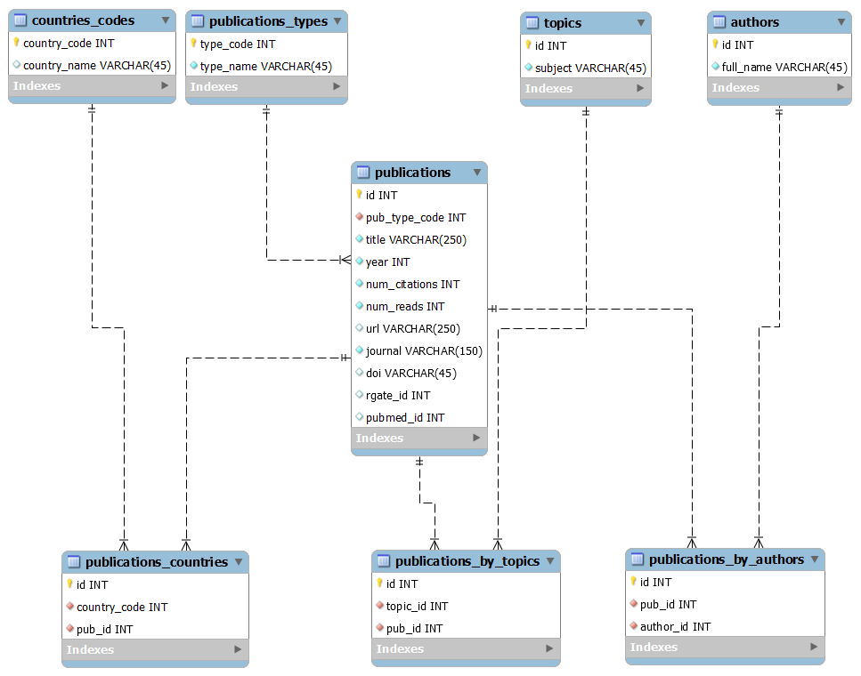

# Program goal
The aim of the program is to extract data from the ResearchGate site (https://www.researchgate.net/) about articles in the energy-market.
The chosen pages provide information about the title, abstract, authors, citations, publication date and journals.
Based on this data we wish to gain a perspective on the energy-market, its status and the new directions that are being explored.

## Installation
The program has been developed in Pycharm IDE, using Selenium web driver and Beautifulsoup
(as described in the requirements).

Note, if errors about lxml appear during the execution of the program then install the 'lxml' package in the pycharm interpeter following these steps:

The program uses a configuration file named config.info, that should reside in the running directory of the program. 

## Usage 
All parameters needed for the program, are taken from the JSON configuration file:
 - User(email) and password for the login to the ResearchGate site  
 - Topic name 
 - The number of the pages that should be processed for the topic. 
 Note: each page contains 10 references.

## Database: DataMining
Here's the ERD diagram:

### Tables: 
1. publications: 
     Columns:
      - id - INT - primary key: identifier number from the publication's URL
      - pub_type_code - INT - code of publication type
      - title - VARCHAR(150) - publication title
      - year - INT - year of publication
      - citations - INT - number of citations
      - reads - INT - number of publication reads
      - url - VARCHAR(150) - url of publication
      - journal - VARCHAR(45) - journal name

   2. publication_types
        Columns:
       - type_code - INT - primary key: code of publication type
       - type_name - VARCHAR(45) - description of publication type
   
   3. publication_by_authors
        Columns:
       -  id (auto - increment) - INT - primary key: technical index
       -  pub_id - INT - foreign key: publications.id
       -  author_id - INT - foreign key: authors.id
   
   4. publications_by_topics
        Columns:
       - id - INT - primary key: technical index
       - topic_id - INT - foreign key: topics.id
       - pub_id - INT - foreign key: publications.id
   
    5. topics
        Columns:
       - id - INT - primary key: technical code of topic
       - subject - VARCHAR(45) - topic description
    
    6. authors
        Columns:
       - id (auto - increment) - INT - primary key: technical index 
       - full_name - VARCHAR(45) - author's full name

### Schema installation instructions:
The program requires the creation of the above DB tables. 
For this, the script file data_mining_db_creation.sql should be run in advance.